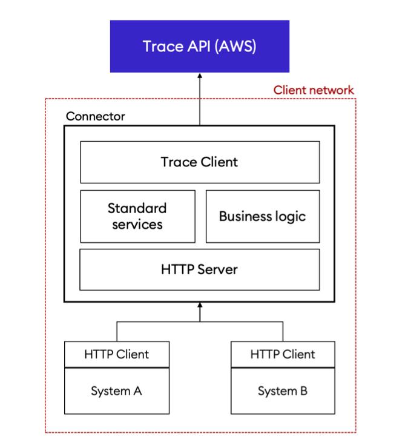

# GO-CONNECTOR

The connector is a modular HTTP server acting as a middleware between the Trace API and a client application.

It is meant to be deployed on-premise on the client infrastructure, in order to benefit from the ability to access the client's decryption key. It’s purpose is to handle all the logic that cannot be handled in Trace backend:

- Decryption
- Validation that cannot be performed sever side
- Replication
- Search
- Analytics

## Development

```shell
$> make build # Build the server binaries for all platforms.
$> make install # Build the server binary for the current platform and install it in the PATH.
$> make docker_image # Build a docker image.
```

## Definition

<p align="center">
    
</p>

Trace is built as private by design, meaning that all the data stored on our servers is encrypted and Stratumn never has access to any of it. Consequently, the API is limited in which features it can offer: it is not possible to search on encrypted data (eg: the content of an attestation), nor to provide analytics on it (please note that this is not the case for meta data, which is not encrypted, making these features available). The connector is an answer to this, being able to access our customer keys, it can work on decrypted data.

In the end, the client systems never talks to Trace API directly, it always go through the connector which relays the requests and forward the (decrypted) responses.

## Action scope

The connector is designed to be fully modular in order to fit any use case our customer may have. The following modules are available and can be plugged-in depending on the needs.

**Search**: All the data specific to the customer workflows is replicated and indexed by this module to offer advanced search features: full-text search, filtering and ordering.

**Analytics**: A tailored set of analytics, defined by the customer, can be provided through this module. This can be used to display insightful dashboards and optimise the business processes.

**Business logic**: Whatever specific business logic can be executed on the connector. This module can connect directly with the client’s own systems or database as well as interacting with the Trace platform.
Business logic can also be automated: this module can wait for new events on a given workflow and automatically create new ones in response.
This module also can enforce custom validation rules specific to our customer business case and that are provided by him/her.

**Replication**: The customer can keep a (decrypted) copy of the business data hosted on the Trace platform in its own database.

## Deployment

As stated before, the connector must be able to access the customer decryption key, therefore it needs to run on the customer infrastructure.

Deployment strategies will vary depending on the customer infrastructure and requirements. We identify three ones:

1. the connector is deployed on the customer’s cloud.
2. the connector is deployed on-premise, directly on the customer’s infrastructure.
3. the connector is deployed by Stratumn, on Stratumn’s secure cloud.

In the first case, deployment is fairly simple. Stratumn provides an out-of-the-box deployment configuration for the major cloud providers (AWS, GCP, Azure), therefore the effort will be minimal for the customer IT team.

In the second case however, the deployment process will depend on the infrastructure and its constraints. We provide binaries for linux, mac and windows as well as a docker image ready to use. With this approach, the customer IT team will have to handle the deployment and maintenance of the solution using the documentation Stratumn provides.

Finally in the third case, the customer would give Stratumn a way to access its keys, and to decrypt data on his behalf. It is the easiest deployment path for the customer, since Stratumn takes care of it almost entirely, except for the key provision. However, it means that the customer trusts Stratumn with its data since it will transit unencrypted on our own servers.

## Authentication

Since it will deal with sensitive business and personal data, the access to the connector should be strictly controlled. This can be achieved in several ways:

1. The connector is publicly accessible (eg: runs in the cloud with a public IP address) and access is controlled by an authentication layer. In this case, users interacting with the controller need to authenticate their request using Stratumn identity system, which can integrate with the customer identity provider (via OAuth) if one is in place.
   The advantage of this solution is that ACL is enforced at the Trace API layer rather than at the connector layer, reducing the need for custom logic in the latter. It also allows the customer to deploy a single connector for multiple entities.

2. Access to the connector is restricted by a proxy server which integrates with the customer’s identity management system. This allows a great level of flexibility (internal systems may interact with the connector without going through Stratumn’s authentication system, there can be a single connector for multiple entities) but it comes to a price: this solution demands a high level of integration (for the customer IT team) which can be costly in term of development and maintenance. However, as the proxy server is developed on the customer side, it does not add any complexity to the connector itself.

3. The connector runs in a private, closed network which can be accessed only from the customer machines or through a VPN provided by the customer. In this case, there is no ACL logic in the connector since it is enforced at the network layer. It means the connector is scoped to a single entity and that the number of connectors scales horizontally with the number of entities taking part in a workflow. This solution maybe be harder to maintain in term of infrastructure.

## Handling keys

Trace uses Public Key Encryption (PKE) to end-to-end encrypt the data that transits through the platform. PKE relies on cryptographic key pairs (a _public_ key and a _private_ key) to encrypt and decrypt data. The connector therefore needs to have access to the encryption key pair of the organisation it wants to decrypt data for.
If the security of the private key is compromised, an attacker might have access to all the decrypted data. Also note that if the decryption key is lost, there is no way to recover the encrypted data and it is lost forever ; of course, there are ways to mitigate that.

In addition to privacy, auditability and traceability are key features of the Trace platform. [Digital signatures](https://en.wikipedia.org/wiki/Digital_signature) are used to link actions to entities (either a user, a team or an organisation) which allows to be able to trace back and identify who did a specific action on the platform. Digital signatures use a similar mechanism as PKE as it relies on a cryptographic key pair to sign (authenticate) and verify the origin of a message.
The connector signs messages on behalf of the organisation it belongs to, making it easier for users to interact with Trace API in a trusted way. The connector therefore needs to have access to the signing key pair of the organisation on behalf of which it wants to sign data.

Key management is therefore a topic that must be seriously taken into consideration. It is up to the customer’s IT team to decide how they want to tackle this issue (there is probably a solution already in place). For a high degree of security, we recommend using a [Hardware Security Module](https://en.wikipedia.org/wiki/Hardware_security_module) with which the connector can integrate.

## Maintenance

The customer will have to assume the responsibility of maintaining its own connector, keeping it up to date with new releases and developing use-case specific features if needed (?).

In order to help our customer to achieve this, we actively maintain the open-source libraries on which the connector is based and we frequently publish releases with enhancements, vulnerability patches etc…

In addition, Stratumn provides a well furnished documentation (high level overview, low level specification, code documentation) to make it easy for the customer’s IT team to work with.

## Licensing

The connector of the customer will of course remain private as it deals with the customer business logic. However, the libraries with which the connector is built are open-source thus completely auditable by anyone. You will find a detailed list of all the dependencies in the `go.mod` file.
